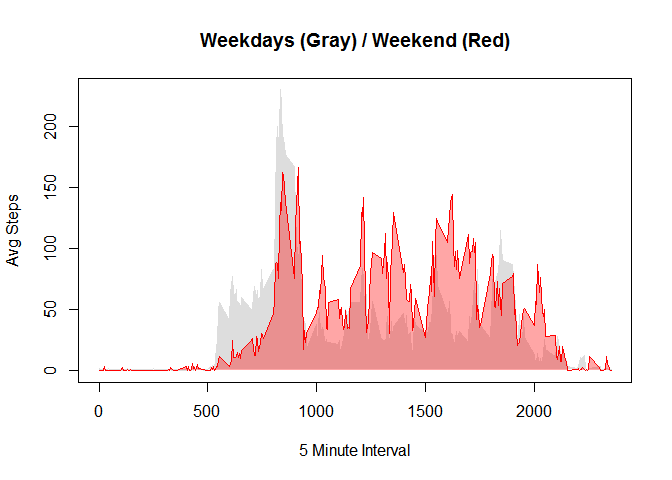

# Reproducible Research: Peer Assessment 1


## Loading and preprocessing the data

First unzip and read the CSV file into a variable.

The fields are:

+ **steps**: # of steps taken

+ **date**: in YYYY-MM-DD format

+ **interval**: 5 minute interval


```r
unzip("activity.zip")
data <- read.csv("activity.csv")
head(data)
```

```
##   steps       date interval
## 1    NA 2012-10-01        0
## 2    NA 2012-10-01        5
## 3    NA 2012-10-01       10
## 4    NA 2012-10-01       15
## 5    NA 2012-10-01       20
## 6    NA 2012-10-01       25
```

```r
summary(data)
```

```
##      steps                date          interval     
##  Min.   :  0.00   2012-10-01:  288   Min.   :   0.0  
##  1st Qu.:  0.00   2012-10-02:  288   1st Qu.: 588.8  
##  Median :  0.00   2012-10-03:  288   Median :1177.5  
##  Mean   : 37.38   2012-10-04:  288   Mean   :1177.5  
##  3rd Qu.: 12.00   2012-10-05:  288   3rd Qu.:1766.2  
##  Max.   :806.00   2012-10-06:  288   Max.   :2355.0  
##  NA's   :2304     (Other)   :15840
```

## What is mean total number of steps taken per day?

First aggregate the data and plot a histogram of the total steps per day.  Then compute the mean and median of steps per day.  It would appear that people who track their steps walk a lot farther than the average person.


```r
aggdata <- aggregate(steps~date, data=data, FUN=sum, na.rm=T)
# names(aggdata) <- c("date","steps")
hist(aggdata$steps, breaks=25, main="Histogram of Total Steps Per Day", 
     xlab="Total Steps per Day",col=c("cadetblue1","aquamarine"))
```

<!-- -->

```r
steps.mean <- mean(aggdata$steps)
steps.median <- median(aggdata$steps)
print(paste( "Mean Steps: ", as.integer(steps.mean),"  Median Steps: ", steps.median))
```

```
## [1] "Mean Steps:  10766   Median Steps:  10765"
```

## What is the average daily activity pattern?

First aggregate the data to average number of steps per interval.  Then plot a line chart fo the results.  Finally determine the interval with maximum average number of steps.


```r
aggdata <- aggregate(steps~interval, data=data, FUN=mean, na.rm=T)
# names(aggdata) <- c("interval","steps")
plot(aggdata,type="l",main="Average Steps per Interval",xlab="5 Minute Interval",ylab="Average Steps")
```

<!-- -->

```r
maxrow <- aggdata[which.max(aggdata$steps),]
print(paste( "Maximum interval is ", maxrow$interval, " with average steps of ", as.integer(maxrow$steps)))
```

```
## [1] "Maximum interval is  835  with average steps of  206"
```

## Imputing missing values

Note that there are a number of days/intervals where there are missing values (coded as NA). The presence of missing days may introduce bias into some calculations or summaries of the data.

1. Calculate and report the total number of missing values in the dataset (i.e. the total number of rows with NAs)

2. Strategy to replace NA step values with mean of steps taken during that period.

3. Create a new dataset data.fixed that is equal to the original dataset but with the missing data filled in.

4. Make a histogram of the total number of steps taken each day and Calculate and report the mean and median total number of steps taken per day. Do these values differ from the estimates from the first part of the assignment? What is the impact of imputing missing data on the estimates of the total daily number of steps?


```r
steps.missing <- sum(is.na(data$steps))
print(paste("# Missing Steps: ", steps.missing))
```

```
## [1] "# Missing Steps:  2304"
```

```r
# Get median of steps aggregated by interval.
aggdata <- aggregate(steps~interval, data=data, FUN=mean, na.rm=T)
#names(aggdata) <- c("interval","steps")

# Assign median steps to NA values at corresponding interval.
data.fixed <- data
for (i in which(is.na(data.fixed$steps))) {
  data.fixed[i,1] <- aggdata[aggdata$interval==data.fixed[i,3],]$steps
}
```

In recomputing the mean and median the values did not change much.


```r
# Aggregate fixed data total steps per day.
aggdata <- aggregate(steps~date, data=data.fixed, FUN=sum, na.rm=T)
#names(aggdata) <- c("date","steps")

hist(aggdata$steps, breaks=25, main="Histogram of Total Steps Per Day - Fixed", 
     xlab="Steps per Day - Fixed Dataset",col=c("cadetblue1","aquamarine"))
```

<!-- -->

```r
steps.fixed.mean <- mean(aggdata$steps)
steps.fixed.median <- median(aggdata$steps)
print(paste( "Mean Fixed Steps: ", as.integer(steps.fixed.mean),
             "  Median Fixed Steps: ", as.integer(steps.fixed.median)))
```

```
## [1] "Mean Fixed Steps:  10766   Median Fixed Steps:  10766"
```
## Are there differences in activity patterns between weekdays and weekends?

Based on these plots it appears that activity on weekdays begins earlier in the day, but activity between periods 100-2000 is much greater on the weekend.

This relationship is even clearer when data is superimposed as shown in last plot.

Apparently these people are not spending all weekend at their computers taking CourseRA classes.  ;O


```r
# Convert day names to factors weekday/weekend.
# Probably a much cooler way to do this...  ;/
weekday <- weekdays(as.Date(as.character(data.fixed$date)))
weekday[weekday=="Monday"] <- "weekday"
weekday[weekday=="Tuesday"] <- "weekday"
weekday[weekday=="Wednesday"] <- "weekday"
weekday[weekday=="Thursday"] <- "weekday"
weekday[weekday=="Friday"] <- "weekday"
weekday[weekday=="Saturday"] <- "weekend"
weekday[weekday=="Sunday"] <- "weekend"
weekday <- as.factor(weekday)

data.fixed$weekday <- weekday  # assign column

# Aggregate the data to get average number of steps by interval and weekday factor.
aggdata = aggregate(steps~interval+weekday,
                    data=data.fixed,
                    FUN=mean, na.rm=T)
#names(aggdata) <- c("interval","weekday","steps")

par(mfrow=c(2,1))
plot(aggdata[aggdata$weekday=="weekday",]$interval,
     aggdata[aggdata$weekday=="weekday",]$steps,type="l",
     xlab="5 Minute Interval", ylab="Avg Steps",main="Weekdays (M-F)")
plot(aggdata[aggdata$weekday=="weekend",]$interval,
     aggdata[aggdata$weekday=="weekend",]$steps,type="l",
     xlab="5 Minute Interval", ylab="Avg Steps",main="Weekend (Sa,Su)")
```

<!-- -->

```r
par(mfrow=c(1,1))

# bonus superimposed plot to see alternate view of data.
plot(aggdata[aggdata$weekday=="weekday",]$interval,
     aggdata[aggdata$weekday=="weekday",]$steps, type="l", col="#DDDDDD",
     xlab="5 Minute Interval", ylab="Avg Steps",main="Weekdays (Gray) / Weekend (Red)")
polygon(aggdata[aggdata$weekday=="weekday",]$interval,
+      aggdata[aggdata$weekday=="weekday",]$steps, 
       col="#DDDDDD", border=NA)
points(aggdata[aggdata$weekday=="weekend",]$interval,
     aggdata[aggdata$weekday=="weekend",]$steps, type="l", col="red")
polygon(aggdata[aggdata$weekday=="weekend",]$interval,
+      aggdata[aggdata$weekday=="weekend",]$steps, 
       col=rgb(1,0,0,.35), border=NA)
```

<!-- -->
